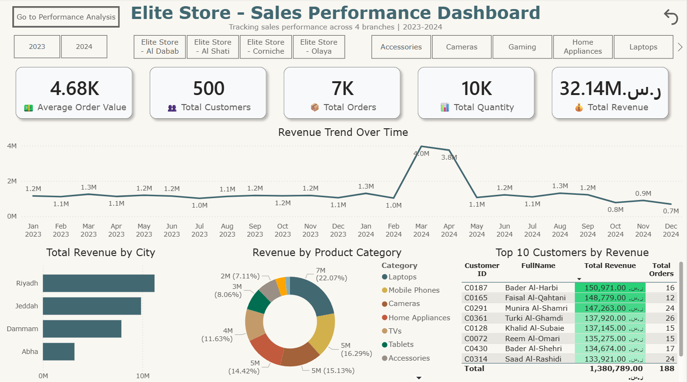

# Elite Store - Sales Performance Dashboard

An interactive Power BI dashboard analyzing sales performance for a fictional electronics retailer with 4 branches across Saudi Arabia.



## 📊 Project Overview

**Business Scenario:**
Elite Store, an electronics and home appliances retailer, experienced unexpected revenue decline in Q4 2024. The Sales Manager needs an interactive dashboard to answer:

- When did the decline start?
- Which branch is most affected?
- Who are our top customers?
- Which product categories are growing/declining?

## 🎯 Key Findings

- **Total Revenue:** 32.14M SAR (2023-2024)
- **YoY Growth:** +33.49% overall
- **Ramadan Spike:** 3x normal monthly revenue in March-April 2024
- **Q4 2024 Decline:** -35% compared to Q4 2023 ⚠️
- **Abha Branch:** Newest branch with highest growth rate (+40% YoY)

## 🛠️ Tools & Technologies

- **Power BI Desktop**
- **Power Query** (Data Cleaning & Transformation)
- **DAX** (Calculated Measures & Time Intelligence)
- **Data Modeling** (Star Schema)

## 📐 Data Model

The project uses a **Star Schema** with:
- 1 Fact Table: `Sales`
- 4 Dimension Tables: `Products`, `Stores`, `Customers`, `DateTable`

## 🧮 Key DAX Measures

```dax
Total Revenue = 
CALCULATE(
    SUMX(Sales, Sales[Quantity] * Sales[UnitPrice]),
    Sales[OrderStatus] = "Completed"
)

Revenue Last Year = 
CALCULATE(
    [Total Revenue],
    SAMEPERIODLASTYEAR(DateTable[Date])
)

Revenue Growth % = 
DIVIDE(
    [Total Revenue] - [Revenue Last Year],
    [Revenue Last Year]
)
```

## 🧹 Data Cleaning Process

Used Power Query to clean ~7,500 sales records:
- Removed 10 duplicate orders
- Standardized date formats (DD/MM/YYYY → YYYY-MM-DD)
- Trimmed extra spaces in payment methods
- Unified customer ID casing (uppercase)
- Handled null quantity values
- Converted text percentages to decimal format

## 📂 Repository Structure

```
├── data/
│   ├── Sales.csv
│   ├── Products.csv
│   ├── Stores.csv
│   └── Customers.csv
├── screenshots/
│   ├── overview.png
│   ├── performance-analysis.png
│   ├── data-model.png
│   └── power-query.png
├── Elite_Store_Sales_Dashboard.pbix
└── README.md
```

## 🚀 How to Use

1. Clone this repository
2. Open `Elite_Store_Sales_Dashboard.pbix` in Power BI Desktop
3. Refresh data sources if needed
4. Explore the interactive dashboard

## ⚠️ Disclaimer

All data in this project is **synthetic** and generated for educational purposes only. It does not represent any real company or individuals.

## 👤 Author

Abdulmalek Alburaidy
- LinkedIn: linkedin.com/in/abdulmalekalburaidy
- GitHub: github.com/AbdulmalekB

## 📝 License

This project is licensed under the MIT License.
